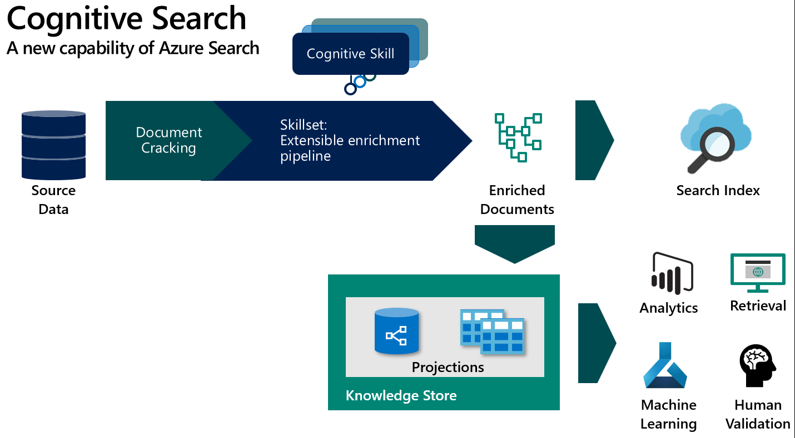

# Add Cognitive Serach to the Solution
Cognitive Search is a feature of Azure Search which enables the ingestion of lrge volumes of data, enriching it with AI skills and projecting it into a search index and a knowledge store for use in analytics and data exploration.

You will need a provisioned Azure Search instance to continue. To use this sample:
+ Deploy the Azure Function 
+ Use the sample REST API requests to create the flooing resources
  + Datasource (Blob storage account where your files from the transcribe process are saved)
  + Skillset 
    + Update the Cognitive Services Key to call the Text Analytics skills
    + Update the knowledge store connection string to a valid general purpose storage account
    + Update the URL for the custom skill to the URL of the Azure Function you just deployed
  + Search Index
  + Indexer 
+ Use the sample PowerBI dashboard to connect to the knowledge store and visualize your data.

