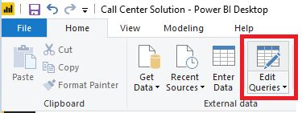
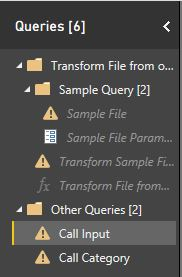
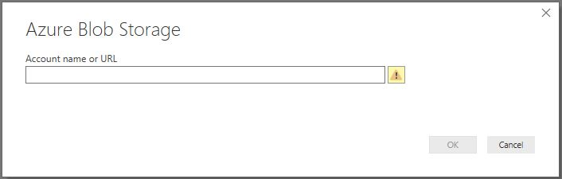
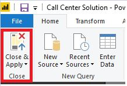

# Power BI Setup

## Simple Steps
Open Power BI App-> Open Call Center Solution PBIX file -> Select Edit Queries -> Update Source for tables Call Input -> Provide Account information for Azure Blob -> Select final step and wait for refresh -> Update source for Call Category and follow steps as above -> On completion of refresh and no errors. Select Close and Apply -> Report is refreshed and ready to use.

## Detailed Steps

Steps to use new Azure Blob source:

1.    Open Power BI app.
2.    Open call center solution (PBIX File). (File -> Open ->Browse -> Select file)
3.    Select “Edit Queries”. This opens a new window.

4.	Select “Call Input” table on left pane.

5.	Select “Source” on Applied Steps (right pane).
6.	Double Click on “Source”. This will open a small new window.

7.	Enter the account name. Select ok
8.	Enter the account key. Select ok.
9.	In Applied Steps (right pane), Select Final Step. Wait for refresh to complete.
10.	Select “Call Category” table on left pane.
11.	Follow Steps 3 to 8.
12.	Select “Close & Apply”.

13.	Window will close and refresh the charts.
14.	All the charts are now refreshed, and Report is ready is use.

Note: Key phrases can be filtered on Filter pane. Remove any irrelevant key phrases. This filter applies to all pages of the report. 
